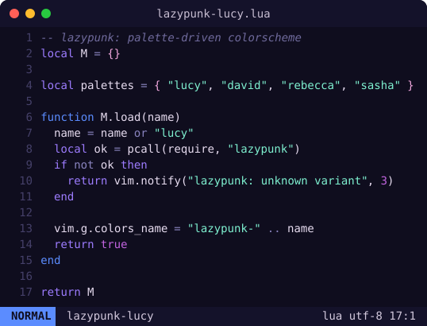
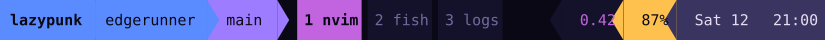
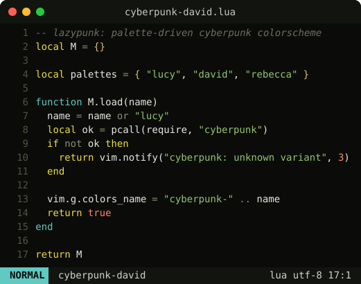
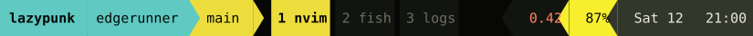
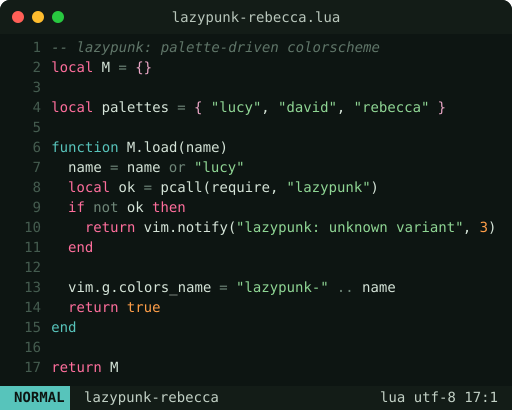
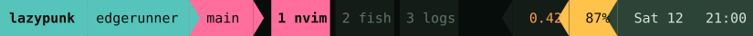

# lazypunk

A palette-driven, Cyberpunk: Edgerunners inspired theme for Neovim and tmux.
Every variant is a single palette table; the Neovim highlight groups and the
tmux status bar both read only semantic role names, so adding a variant means
adding a palette - nothing else.

## Variants

### `lazypunk-lucy` — cool indigo night; neon violet / electric blue / magenta




### `lazypunk-david` — warm gritty night; signature electric yellow + teal




### `lazypunk-rebecca` — murky teal-green night; hot pink + mint + amber




## Neovim

### lazy.nvim

```lua
{ "achiurizo/lazypunk", lazy = false, priority = 1000 }
```

Local development (from a clone):

```lua
{ dir = vim.fn.expand("~/code/lazypunk"), name = "lazypunk", lazy = false, priority = 1000 }
```

Then:

```lua
vim.cmd.colorscheme("lazypunk-lucy")
```

Under LazyVim:

```lua
{ "LazyVim/LazyVim", opts = { colorscheme = "lazypunk-lucy" } }
```

## tmux

Ships as [tmux-powerline](https://github.com/erikw/tmux-powerline) themes
(`tmux-powerline/themes/lazypunk-<variant>.sh`). Truecolor terminal required
(`set -g default-terminal "tmux-256color"` + an `RGB`/`Tc` override); the themes
use the palette hex directly.

Point tmux-powerline at the themes and select a variant in your
`tmux-powerline/config.sh`:

```sh
export TMUX_POWERLINE_THEME="lazypunk-lucy"
export TMUX_POWERLINE_DIR_USER_THEMES="/path/to/lazypunk/tmux-powerline/themes"
```

The theme keeps the standard powerline segment layout (session, host, VCS
branch on the left; load, battery, date/time on the right) and recolors it per
variant. A Nerd/Powerline-patched font gives the arrow separators.

## Structure

```
colors/lazypunk-{lucy,david,rebecca}.lua   -- :colorscheme entry points
lua/lazypunk/init.lua                       -- M.load(name)
lua/lazypunk/theme.lua                       -- assembles highlight groups from palette
lua/lazypunk/groups/                         -- editor, syntax, treesitter, lsp (pure palette -> hl table)
lua/lazypunk/palettes/                       -- one table per variant (the single source of truth)
tmux-powerline/themes/lazypunk-*.sh          -- generated tmux-powerline themes
scripts/gen_tmux.lua                          -- palette -> tmux-powerline theme
scripts/gen_showcase.lua                      -- palette -> Neovim editor SVG (README)
scripts/gen_tmux_showcase.lua                 -- palette -> tmux status-bar SVG (README)
```

The tmux themes and both showcase images are generated from the same palette
tables, so a new variant's palette drives everything:

```sh
nvim --headless -l scripts/gen_tmux.lua <variant> tmux-powerline/themes/lazypunk-<variant>.sh
nvim --headless -l scripts/gen_showcase.lua <variant> assets/showcase-<variant>.svg
nvim --headless -l scripts/gen_tmux_showcase.lua <variant> assets/tmux-<variant>.svg
```

## Adding a variant

Drop a palette table at `lua/lazypunk/palettes/<name>.lua` mirroring the keys in
an existing palette, then add a two-line `colors/lazypunk-<name>.lua`:

```lua
-- :colorscheme lazypunk-<name>
require("lazypunk").load("<name>")
```
