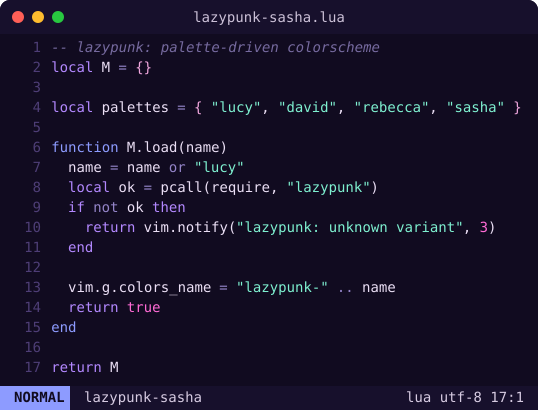
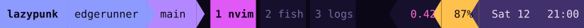

# lazypunk

[](https://github.com/achiurizo/lazypunk/actions/workflows/ci.yml)

A palette-driven, Cyberpunk: Edgerunners inspired theme for Neovim and tmux.
Every variant is a single palette table; the Neovim highlight groups and the
tmux status bar both read only semantic role names, so adding a variant means
adding a palette - nothing else.

## Variants

<!-- variants:start (generated by scripts/gen_readme.lua — do not edit by hand) -->
### `lazypunk-lucy` — cool indigo night; neon violet / electric blue / magenta


<br>


### `lazypunk-david` — warm gritty night; signature electric yellow + teal


<br>


### `lazypunk-rebecca` — murky teal-green night; hot pink + mint + amber


<br>


### `lazypunk-sasha` — violet-black ground, periwinkle and pink neon, mint strings


<br>

<!-- variants:end -->

## Requirements

- **Neovim** ≥ 0.8 in a truecolor-capable terminal (the colorscheme enables
  `termguicolors` for you).
- **tmux theme** (optional): a truecolor terminal plus
  [tmux-powerline](https://github.com/erikw/tmux-powerline). Neovim is used only
  to regenerate the themes, not to run them.

## Neovim

### lazy.nvim

```lua
{ "achiurizo/lazypunk", lazy = false, priority = 1000 }
```

Local development (from a clone):

```lua
{ dir = vim.fn.expand("~/code/lazypunk"), name = "lazypunk", lazy = false, priority = 1000 }
```

Then:

```lua
vim.cmd.colorscheme("lazypunk-lucy")
```

Under LazyVim:

```lua
{ "LazyVim/LazyVim", opts = { colorscheme = "lazypunk-lucy" } }
```

## tmux

A truecolor terminal is required either way (`set -g default-terminal
"tmux-256color"` + an `RGB`/`Tc` override); the themes use the palette hex
directly.

### Native (no dependencies)

Recommended. Sets the status bar, window, pane, message, mode, and clock colors
plus a minimal, overridable status line - no plugins or patched fonts needed.

Via [TPM](https://github.com/tmux-plugins/tpm):

```tmux
set -g @plugin 'achiurizo/lazypunk'
set -g @lazypunk_variant 'lucy'   # optional: lucy (default), david, rebecca, sasha
```

Or source a variant directly (no TPM):

```tmux
source-file /path/to/lazypunk/tmux/lazypunk-lucy.conf
```

The status line is set with plain `set -g` options, so anything you define
after sourcing (your own `status-left`/`status-right`) wins.

**Accents only (keep your own status bar).** Set `@lazypunk_status off` before
sourcing to apply just the colors (pane borders, message, copy-mode, clock) and
leave the status bar to another plugin (e.g. tmux-powerline):

```tmux
set -g @lazypunk_status off
source-file /path/to/lazypunk/tmux/lazypunk-lucy.conf
```

**Exported palette.** Each theme also publishes its palette as read-only user
options, so your own config (or scripts) can reuse the exact colors without
hardcoding them - same role names as the Neovim theme:

```tmux
# tmux show-option -gqv @lazypunk_accent   ->  #c264e0
@lazypunk_variant  @lazypunk_bg       @lazypunk_bg_dark  @lazypunk_bg_float
@lazypunk_border   @lazypunk_fg       @lazypunk_fg_dim   @lazypunk_comment
@lazypunk_string   @lazypunk_keyword  @lazypunk_number   @lazypunk_func
@lazypunk_accent   @lazypunk_accent2  @lazypunk_warn     @lazypunk_error
```

### tmux-powerline (optional)

Also ships as [tmux-powerline](https://github.com/erikw/tmux-powerline) themes
(`tmux-powerline/themes/lazypunk-<variant>.sh`) with the standard powerline
segment layout (session, host, VCS branch left; load, battery, date/time
right). Point tmux-powerline at the themes in your `tmux-powerline/config.sh`:

```sh
export TMUX_POWERLINE_THEME="lazypunk-lucy"
export TMUX_POWERLINE_DIR_USER_THEMES="/path/to/lazypunk/tmux-powerline/themes"
```

A Nerd/Powerline-patched font gives the arrow separators.

## Structure

```
colors/lazypunk-{lucy,david,rebecca,sasha}.lua   -- :colorscheme entry points
lua/lazypunk/init.lua                       -- M.load(name)
lua/lazypunk/theme.lua                       -- assembles highlight groups from palette
lua/lazypunk/groups/                         -- editor, syntax, treesitter, lsp (pure palette -> hl table)
lua/lazypunk/palettes/                       -- one table per variant (the single source of truth)
tmux/lazypunk-*.conf                          -- generated native tmux themes
lazypunk.tmux                                 -- TPM entry point (sources tmux/ by @lazypunk_variant)
tmux-powerline/themes/lazypunk-*.sh          -- generated tmux-powerline themes
wt/lazypunk-*.json                            -- generated Windows Terminal color schemes
scripts/gen_tmux_conf.lua                     -- palette -> native tmux theme
scripts/gen_tmux.lua                          -- palette -> tmux-powerline theme
scripts/gen_showcase.lua                      -- palette -> Neovim editor SVG (README)
scripts/gen_tmux_showcase.lua                 -- palette -> tmux status-bar SVG (README)
scripts/gen_wt.lua                            -- palette -> Windows Terminal scheme
scripts/gen_readme.lua                         -- palette headers -> README Variants section
```

The tmux themes, both showcase images, and this README's Variants section are
all generated from the same palette tables, so a new variant's palette drives
everything:

```sh
nvim --headless -l scripts/gen_tmux.lua <variant> tmux-powerline/themes/lazypunk-<variant>.sh
nvim --headless -l scripts/gen_tmux_conf.lua <variant> tmux/lazypunk-<variant>.conf
nvim --headless -l scripts/gen_showcase.lua <variant> assets/showcase-<variant>.svg
nvim --headless -l scripts/gen_tmux_showcase.lua <variant> assets/tmux-<variant>.svg
nvim --headless -l scripts/gen_wt.lua <variant> wt/lazypunk-<variant>.json
nvim --headless -l scripts/gen_readme.lua README.md
```

## Adding a variant

Drop a palette table at `lua/lazypunk/palettes/<name>.lua` mirroring the keys in
an existing palette (its first-line comment `-- lazypunk-<name> — <blurb>.`
becomes the README entry), then add a two-line `colors/lazypunk-<name>.lua`:

```lua
-- :colorscheme lazypunk-<name>
require("lazypunk").load("<name>")
```

Regenerate and the theme, both showcases, and the README Variants entry all
appear.

## Windows Terminal

Each variant ships a generated scheme in `wt/lazypunk-<variant>.json`. Copy the
object into the `schemes` array of Windows Terminal's `settings.json`, then set
the profile's color scheme:

```json
"colorScheme": "lazypunk-rebecca"
```

Terminal programs (shell, `ls`, git, Neovim's `:terminal`) then draw with the
same 16 ANSI colors the Neovim theme uses.

## Website

An interactive showcase lives at **https://achiurizo.github.io/lazypunk/** -
switch variants and watch the whole page recolor from the same palette tables.

The site (`site/`) is a Vite + Svelte app. Palette data is generated from the
Lua palettes, so it never drifts. Run the generator from the repo root first,
then start the dev server from `site/`:

```sh
nvim --headless -l scripts/gen_site.lua site/src/lib/palettes.json   # from the repo root
cd site && bun install && bun run dev   # local dev server with hot reload
```

GitHub Actions regenerates the palette JSON, builds with Bun, and deploys to
Pages on every push to `main` (`.github/workflows/pages.yml`).

## License

[MIT](LICENSE) © Arthur Chiu

A fan project, not affiliated with the makers of _Cyberpunk: Edgerunners_ - just
inspired by its colors. All trademarks belong to their respective owners.
